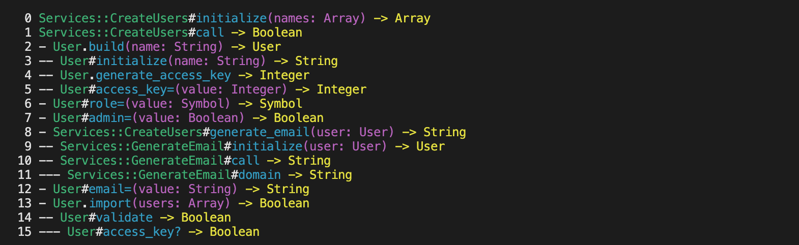

# Ariadne

Follow your code with the Ariadne's Thread! 🧵



## Usage

Run it with:

```ruby
require 'ariadne/thread'

# Initialize a new Ariadne Thread
thread = Ariadne::Thread.new

# Or if you want to output only when the code is in specific paths or when it is not,
# use the params `include_paths` and `exclude_paths`/
# The default path is the root of the repository,
# in order not to display logs from the gems.
thread = Ariadne::Thread.new(
  include_paths: ["app/models", "app/services"],
  exclude_paths: ["app/services/helpers"],
)

# Then, pass a block to the #call method to output the thread
thread.call do
  service = ExportService.new(ids: [42]).call
  service.call
end
#=> Output:
#  0 ExportService#initialize(ids: [42]) -> [42]
#  1 ExportService#call -> true
#  2 - ExportService#get_records -> [#<User:42>]
#  3 -- User.where(ids: [42]) -> [#<User:42>]
#  4 - ExportService#to_hash -> [{:id=>42, :name=>"Jane Doe"}]
# ...

# read the seams (1 method call -> 1 seam)
seams = thread.seams
seams.size # 12
seams.map(&:depth).max # 3
seams.map(&:klass).uniq # [ExportService, User]
```

Reading the logs:

* `0` is the iteration. Each time a method is called, it adds 1.
* `---` is the depth (one dash by level of depth). It starts at 0. Each time a method is called inside another method, it adds a level of depth.
* `ExportService` is the name of the class.
* `#` is the method prefix (`.` for a class method, `#` for an instance method).
* `initialize` is the name of the method.
* `ids` is the name of the parameter.
* `[42]` is the argument passed for this parameter. If not a literal, the type is given (`<User>`).
* `-> [42]` is the value returned by the method. If not a literal, the type is given (`<User>`).

The logs are outputed in the terminal and in the `thread.log` file.

## Installation

Add this line to your application's Gemfile:

```ruby
group :development do
  gem "ariadne"
end
```

And then execute:

```bash
$ bundle
```

Or install it yourself as:

```bash
$ gem install ariadne
```

## Contributing

This gem is still a work in progress. You can use GitHub issue to start a discussion.

## License

The gem is available as open source under the terms of the [MIT License](https://opensource.org/licenses/MIT).
